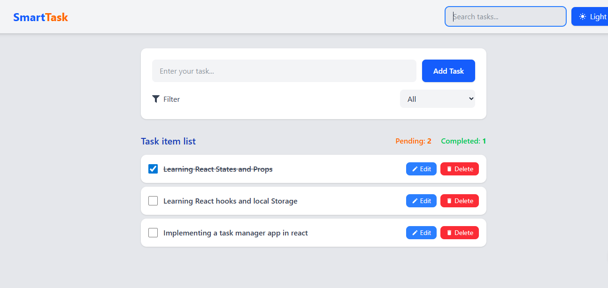
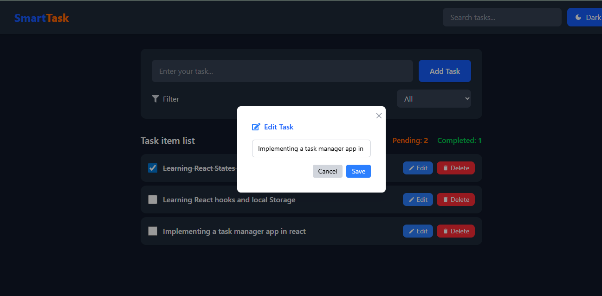
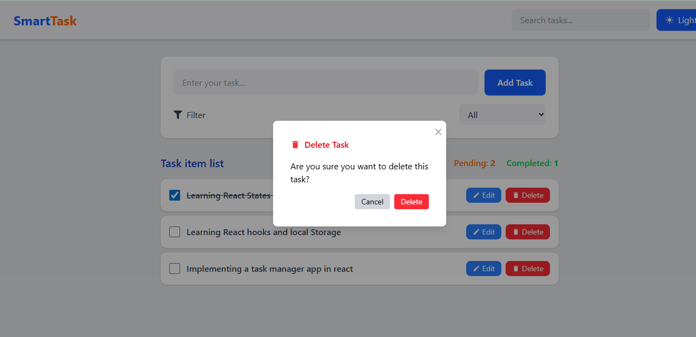
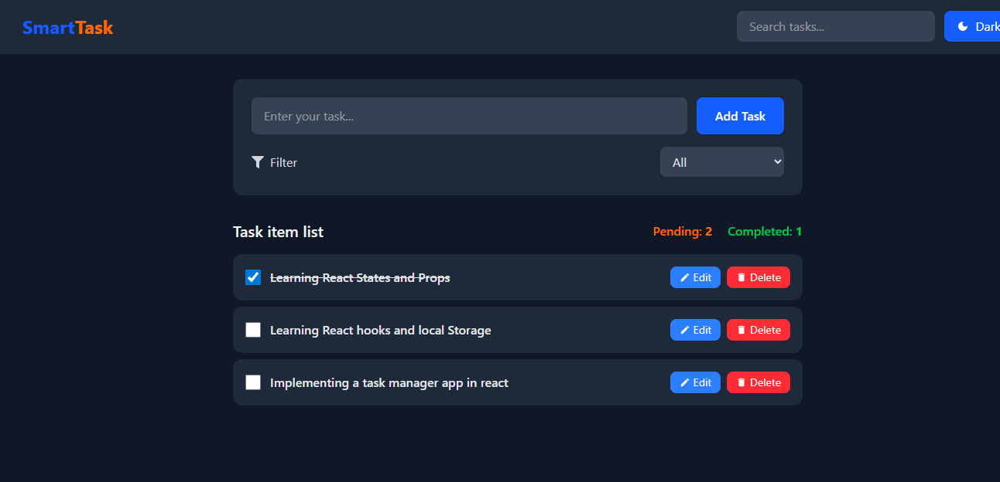

 SmartTask

## Project Overview
SmartTask is a simple, interactive task management application built with React. 
It utilizes the Context API for global state management and Tailwind CSS for styling. 
Users can add, edit, delete, and filter tasks based on completion status.

## Technologies Used
Frontend: React.js
State Management: React Context API
Styling: Tailwind CSS
Icons: React Icons
/src
 ├─ /components
      |-- Header.jsx
 │    ├─ AddTaskForm.jsx      # Form component to add new tasks
 │    ├─ TaskItemList.jsx     # List of tasks with Edit/Delete actions
 │    ├─ ui
 │    │   └─ Modal.jsx        # Reusable modal component
 ├─ /context
 │    └─ TaskContext.jsx      # Context API state management
 ├─ App.jsx                   # Main app component
 └─ index.js                  # App entry point
 # Features
 ## 1. Add Task
## 2. Edit Task
## 3. Delete Task
## 4. Task Completion
## 5. Task Filtering
## 6. Task Statistics

## Screenshots
### Task List

### Edit Task

### Delete Task

### Light Mode vs Dark Mode
| Light Mode | Dark Mode |
|-----------|-----------|
|  |  |

# Installation
npm install
npm run dev
